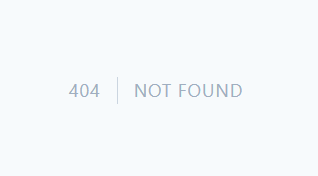

# JOBSHEET 02 ROUTING, CONTROLLER, DAN VIEW

> Nama : Farid Fitriansah Alfarizi \
> NIM : 2241720055 \
> Absen : 12 \
> Kelas : 2F

## Basic Routing

1. Route Hello \
   

2. Route World \
   

3. Route Index \
   

4. Route About \
   

## Route Parameters

1. Route User \
   

2. Route User Not Found \
   

3. Route Posts Comments \
   

4. Route Articles \
   

## Optional Parameters

1. Route User Undefined \
   

2. Route User Parameter \
   

3. Route User Default \
   

## Membuat Controller

1. Welcome Controller \
   

2. Page Controller Index \
   

3. Page Controller About \
   

4. Page Controller Articles \
   

5. Home Controller \
   

6. About Controller \
   

7. Article Controller \
   

## Resource Controller

1. Photo Controller \
   

2. List Route \
   

## Membuat View

1. View Hello \
   

## View dalam direktori

1. View Hello Blog \
   

## Menampilkan View dari Controller

1. View Hello Route Greeting \
   

## Meneruskan data ke view

1. View Hello With Data \
   
